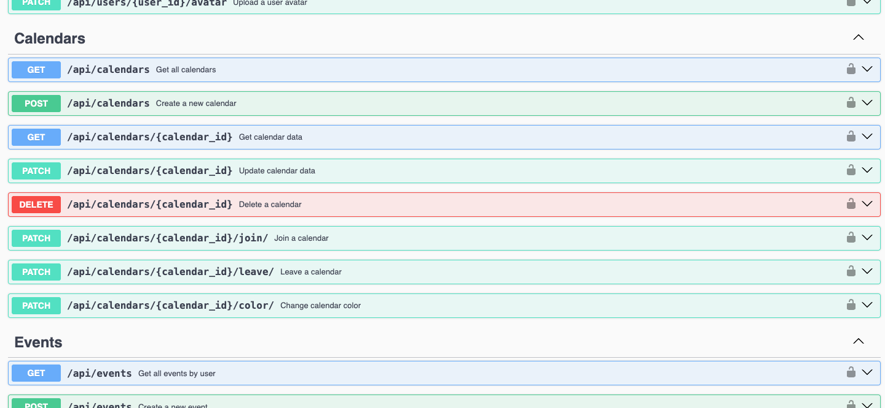

# 🌼 Calendula API

## Short Description


## Screenshots of Solution


## Requirements and Dependencies
- **Node.JS** >= v22
- **NPM** >= v10
- **MySQL** >= 8.0

Before starting, ensure the required technologies are installed.

## Database Setup
The database schema is provided in the `db/db.sql` file. Run the SQL commands in your MySQL database to set up the required tables.

## Docker
```bash
docker-compose --env-file .envDev up -d
```

## How to Run the Solution
1. Clone this repository and move to the project directory.
   ```bash
   git clone <repository-url>
   ```
2. Install the dependencies.
   ```bash
   npm install
   ```
5. Configure the database connection by updating the `.env` file with your MySQL database credentials. Example:
   ```
   DATABASE_HOST=localhost
   DATABASE_PORT=3306
   DATABASE_USER=root
   DATABASE_PASSWORD=root
   ```

5. Log in to your MySQL. 
6. Copy the contents of the [db/schema.sql](db/schema.sql) file and execute it in MySQL. You can also execute the SQL query through the MySQL CLI. To do this, run the command `mysql -u {USER_NAME} -p < db/db.sql`. You need to provide your MySQL login and password.
7. Apply similar steps as in **step 6**, but use the data file [db/data.sql](db/data.sql).
8. Start the server.
   ```bash
   npm run start
   ```

## Mailing Service
[Ethereal](https://ethereal.email/) is a fake SMTP service, mostly aimed at Nodemailer and EmailEngine users (but not limited to). It's a completely free anti-transactional email service where messages never get delivered.
To view the letter that the user will receive, you need to log in to this service using a test login and password.

```text
login: ricky43@ethereal.email
password: 4e1zbM2nxsMu2d823E
```

## REST API documentation
The documentation of all available endpoints can be found [http://localhost:8080/api-docs/](http://localhost:8080/api-docs/). The [Swagger](https://swagger.io/) library is used.



## Additional Features
- ...

## Full Documentation
- ...

## Fake Data
All users has password: `$User2025`. It's fake data for presentations.
### User emails for presentations
* 
