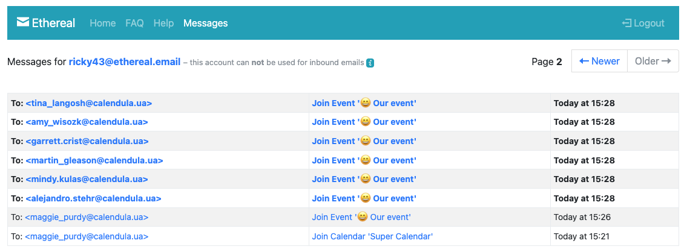
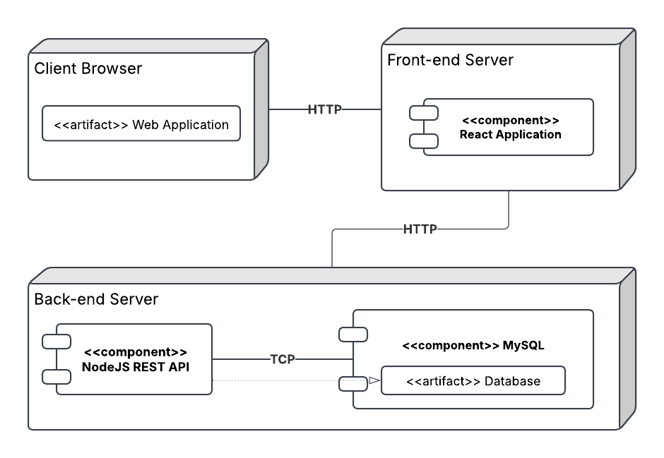

# 🌼 Calendula API

## Short Description
Calendula is a service for managing meetings and tasks within a company.
You can invite colleagues to participate in the implementation of your tasks and discuss them.
All participants will be notified of the upcoming event.

## Requirements and Dependencies
Before starting, ensure the required technologies are installed.
- **Node.JS** >= v22
- **NPM** >= v10
- **MySQL** >= 8.0


## How to Run the Solution
1. Clone this repository and move to the project directory.
   ```bash
   git clone <repository-url>
   ```
2. Install the dependencies.
   ```bash
   npm install
   ```
3. Configure the database connection by copying [.env.development.example](.env.development.example) to new file `.env.development`. After that put your MySQL credentials.
   ```
   # Example
   DATABASE_HOST=localhost
   DATABASE_PORT=3306
   DATABASE_USER=root
   DATABASE_PASSWORD=root
   ```
   For testers, you need to create `.env.test` based on the `.env.test.example` files.
4. Configure the migrations config by copying [migration_config.json.example](db/migration_config.json.example) to new file `db/migration_config.json`. After that put your MySQL credentials to `dev` part. ☝️ Don't add part about "database".
   ```json
   {
       "dev": {
          "driver": "mysql",
          "user": "root",
          "password": "root",
          "port": 3306,
          "multipleStatements": true
     }
   }
   ```
5. Run migration for create database `Calendula`.
   ```shell
   npm run migrate:db:create:dev -- Calendula
   ```

   > If you get the error _“ifError got unwanted exception: Unknown database 'Calendula'”_, then delete the ‘database’ field in the configuration file `db/migration_config.json`. Then run the command again.

6. Add the “database” field to `db/migration_config.json`. The `dev` environment configuration may look like this:
   ```json
   {
       "dev": {
          "driver": "mysql",
          "user": "root",
          "password": "root",
          "port": 3306,
          "multipleStatements": true,
          "database": "Calendula"
     }
   }
   ```

6. Run migration for create tables in your database.
   ```shell
   npm run migrate:up:dev
   ```

   If you encounter problems, try the command that will delete all tables and create them again.
   ```shell
   npm run migrate:refresh:dev
   ```

7. Start the server.
   ```bash
   npm run start:dev
   ```
8. In new console you can run task scheduler. It's not necessary.
   ```bash
   npm run scheduler:<env>
   ```


## Database Migration
Migrations are possible on such environments: `dev`, `test`, and `prod`.

Environment settings are loaded from a `./db/migration_config.json` file. Create your `./db/migration_config.json` file and add the properties for the environments to it. To do this, copy `./db/migration_config.json.example` or to `./db/migration_config.json`. Then edit `./db/migration_config.json` if necessary (e.g. add a test database).

Note that migrations are only possible on **existing databases**. Therefore, create your database first. Example of a database creation query to be executed in the database console:
```sql
DROP DATABASE IF EXISTS Calendula;
CREATE DATABASE Calendula;
USE Calendula;
```
or
```sql
DROP DATABASE IF EXISTS Calendula_Test;
CREATE DATABASE Calendula_Test;
USE Calendula_Test;
```
Or use commands: `migrate:db:create:<env>` and `migrate:db:drop:<env>`.

In the examples of all commands below in the text `<env>` is the name of the environment to perform the migration, e.g. `dev`, `test` or `prod`.

**To create tables and test data in the database, execute the command:**
```bash
npm run migrate:up:<env>
```
To update the tables and test data in the database, run the following command (`reset` and `up`):
```bash
npm run migrate:refresh:<env>
```
Full list of commands:
1. The `create` command creates a migration that loads sql file with the name `<migration-name>` in configured migrations directory `./db/migrations`.
   ```bash
   npm run migrate:create:<env> -- <migration-name>
   ```
Where `<migration-name>` is the name of the migration you are creating, e.g., `update-events-categories`.
2. The `up` command executes the migrations of your currently configured migrations directory. More specific the `up` migrations are being called.
   ```bash
   npm run migrate:up:<env>
   ```
3. The `down` command executes the migrations of your currently configured migrations directory. More specific the `down` migrations are being called.
   ```bash
   npm run migrate:down:<env>
   ```
4. The `reset` command is a shortcut to execute all down migrations and literally reset all migrations which where currently done. The `reset` command also executes by default only the first scope.
   ```bash
   npm run migrate:reset:<env>
   ```
5. To perform `reset` and `up`, run the following command:
   ```bash
   npm run migrate:refresh:<env>
   ```
6. For create database try this command with {DATABASE_NAME}:
   ```bash
   npm run migrate:db:create:<env> -- {DATABASE_NAME}
   ```
7. For delete database try this command with {DATABASE_NAME}:
   ```bash
   npm run migrate:db:drop:<env> -- {DATABASE_NAME}
   ```

Answers to other questions can be found in the official [db-migrate](https://db-migrate.readthedocs.io/en/latest/) documentation.

## Task Scheduler

Our service can process tasks in the background. Currently, we use it to send email notifications about upcoming events.
Scheduler are possible on such environments: `dev`, `test`, and `prod`.
To start the service, you need to run the command.
   ```bash
   npm run scheduler:<env>
   ```

## Docker
Environment variables are taken from `.env.development` file. You can start containers with the command:
   ```bash
   docker-compose --env-file .env.development up -d
   ```

## Mailing Service
[Ethereal](https://ethereal.email/) is a fake SMTP service, mostly aimed at Nodemailer and EmailEngine users (but not limited to). It's a completely free anti-transactional email service where messages never get delivered.
To view the letter that the user will receive, you need to log in to this service using a test login and password. Default credentials you can find in [.env.development.example](.env.development.example)




## REST API documentation
The documentation of all available endpoints can be found [http://localhost:8080/api-docs/](http://localhost:8080/api-docs/). The [Swagger](https://swagger.io/) library is used.


## API Testing
Create an `.env.test` file and add the variables for the test environment to it. To do this, copy `.env.test.example` or to `.env.test`. Then edit `.env.test` if necessary (e.g. add a test database).

Start the server with the command:
```bash
npm run start:test
```
Once the dependencies are installed and the backend is running, you can run the tests. To do this, use the command:
Running all tests:
```bash
npm run test
```
Run all tests and create a report on the results:
```bash
npm run test:report
```
Run tests for a specific component:
```bash
npx playwright test tests/api/<file_name>.test.js --project=chromium --debug
```

## Creative features
- Attendance status for events: Yes, No, Maybe
- Birthdays calendar
- Events search
- Notify before event start
- Event category


## Deployment Diagram


## Fake Data
To fill the database with demo data of users, calendars and events, run the command:
```bash
npm run test:seed
```
Here is the fake data for presentations.

User data for testing:
* full name:
   ```text
   Test User
   ```
* email:
  ```text
  test.user@calendula.ua
  ```
All users have a password:
```text
Password123!$
```