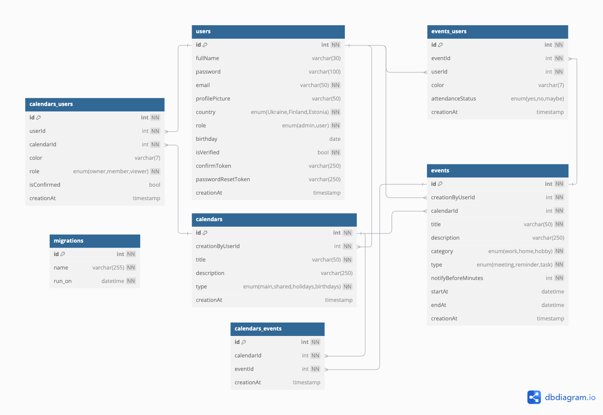

<p align="center">
    
    <h1 align="center">Calendula</h1>
</p>

<p align="center">
	
	
	
	
	
	
	
	
	
	
</p>


## 🗓️ Overview
Calendula is a service for managing meetings and tasks within a company.
You can invite colleagues to participate in the implementation of your tasks and discuss them.
All participants will be notified of the upcoming event.


## 🧑‍💻 Team
<div>
    <ul>
        <li>
            <p>🧑🏼‍💻 <a href="https://github.com/laskevych">Andrew Laskevych</a></p>
        </li>
        <li>
            <p>👩🏼‍💻 <a href="https://github.com/InessaRepeshko">Inessa Repeshko</a></p>
        </li>
        <li>
            <p>🧑🏻‍💻 <a href="https://github.com/vzharyi">Vadym Zharyi</a></p>
        </li>
    </ul>
</div>


# 🌼 About "Calendula" calendar app
Calendula is an enterprise platform that transforms time management with flexible calendars, interactive events, and team sync.

Organise your day, share ideas, and streamline your workflow with easy search, notifications, and a personalised design.

Here is a [link](https://docs.google.com/presentation/d/1UFsV7MbyVHJA5UCWVKEkgtV1f3Buq-kT/edit?usp=sharing) to the presentation file.</p>


## 🎯 Basic features
* User
	* Registration and email confirmation
	* Authorisation
	* Password recovery via email
	* Has its own default Main user calendar
	* Has the 'National holidays' calendar for the user's country
 * Calendars
 	* Contains title, description, color, participants
    	* Invite calendar participants via email
  	* Create calendars via a pop-up window
   	* Calendars can be hidden to filter events 
	* Users can change the colour of any calendar for themselves
	* Roles of Participants in Calendars
 		* Owner can perform all CRUD operations (unlike the main calendar) with the invitation of other registerd users
   		* Member can view the calendar and its events; CRUD operations on own events in this calendar with the invitation of other registerd users
     		* Viewer can view the calendar and its events
       * All calendars are clickable and contain information for preview
* Events
	* Contains title, start date and time, end date and time, associated calendar, type ('meeting', 'reminder', 'task'), description, color, participants
 	* Invite event participants via email
 	* Create events by clicking on the blank space on the calendar itself via a pop-up window, as well as by clicking a 'Create' button and redirecting to a separate page
    	* Edit events by clicking; delete via a special button
  	* By default, colour events based on the colour of the associated calendar
	* Users can change the colour of any event for themselves
        * All events are clickable and contain information for preview
      	* Display all events in accordance with their duration


## 🌈 Creative features
* User
	* View user's personal data
* Calendars
	* Grouping calendars into team and system calendars
	* Calendar 'Birthdays' of company employees
	* Unsubscribing from the calendar via the ‘Unsubscribe’ button
	* Calendar owner's mark
	* Search for users to participate by full name or email
  	* Searchable drop-down list of users to participate in
* Events
	* Preview of the event type in the title
	* Displaying the attendance status of participants
	* Drag and drop to change the date or time of event
	* Resize to change the event duration
	* Event owner's mark
	* Search for users to participate by full name or email
  	* Searchable drop-down list of users to participate in
   	* 'All day' event duration
	* Default duration for events is 1 hour
	* Categories: 'work', 'home', 'hobby'
	* Notifications before: '10 min', '30 min', '1 h', '1 d' 
	* Attendance statuses: 'yes', 'no', 'maybe'
   	* Changing the event design depending on the user's attendance status
* Home page
	* Jump to today via the 'Today' button
	* Search for events by title and description
	* Different representation of the calendar: month, weeek, day
	* Monthly calendar in the sidebar
	* Synchronise between the monthly calendar in the sidebar and main event view
	* Show the current day and time on the calendar


## 👤 Use case diagram
 


## ⚙️ Requirements and Dependencies
Before starting, ensure the required technologies are installed.
- **Node.JS** >= v22
- **NPM** >= v10
- **MySQL** >= 8.0


## 🚀 How to Run the Solution
1. Clone this repository and move to the project directory.
   ```bash
   git clone <repository-url>
   ```
2. Install the dependencies.
   ```bash
   npm install
   ```
3. Configure the database connection by copying [.env.development.example](.env.development.example) to new file `.env.development`. After that put your MySQL credentials.  Example:
   ```
   DATABASE_HOST=localhost
   DATABASE_PORT=3306
   DATABASE_USER=root
   DATABASE_PASSWORD=root
   ```
   For test purposes you need to use `test` env. For this create `.env.test` based on the `.env.test.example` file.
4. Configure the migrations config by copying [migration_config.json.example](db/migration_config.json.example) to new file `db/migration_config.json`. After that put your MySQL credentials to `dev` part. ☝️ Don't add part about "database".
   ```json
   {
       "dev": {
          "driver": "mysql",
          "user": "root",
          "password": "root",
          "port": 3306,
          "multipleStatements": true
     }
   }
   ```
5. Run migration for create database `Calendula`.
   ```shell
   npm run migrate:db:create:dev -- Calendula
   ```
   > If you get the error _“ifError got unwanted exception: Unknown database 'Calendula'”_, then delete the ‘database’ field in the configuration file `db/migration_config.json`. Then run the command again.
6. Add the “database” field to `db/migration_config.json`. The `dev` environment configuration may look like this:
   ```json
   {
       "dev": {
          "driver": "mysql",
          "user": "root",
          "password": "root",
          "port": 3306,
          "multipleStatements": true,
          "database": "Calendula"
     }
   }
   ```
7. Run migration for create tables in your database.
   ```shell
   npm run migrate:up:dev
   ```
   If you encounter problems, try the command that will delete all tables and create them again.
   ```shell
   npm run migrate:refresh:dev
   ```
8. Start the server.
   ```bash
   npm run start:dev
   ```
9. In new console you can run task scheduler. It's not necessary.
   ```bash
   npm run scheduler:<env>
   ```


## 🚚 Deployment Diagram


## 🤓 Database Diagram
A free database visualiser at [dbdiagram.io](https://dbdiagram.io/). Import [database.dbml](docs/database.dbml).



## 🐋 Docker
Environment variables are taken from `.env.development` file. You can start containers with the command:
   ```bash
   docker-compose --env-file .env.development up -d
   ```


## 📦 Database Migration
Migrations are possible on such environments: `dev`, `test`, and `prod`.

Environment settings are loaded from a `./db/migration_config.json` file. Create your `./db/migration_config.json` file and add the properties for the environments to it. To do this, copy `./db/migration_config.json.example` or to `./db/migration_config.json`. Then edit `./db/migration_config.json` if necessary (e.g. add a test database).

Note that migrations are only possible on **existing databases**. Therefore, create your database first. Example of a database creation query to be executed in the database console:
```sql
DROP DATABASE IF EXISTS Calendula;
CREATE DATABASE Calendula;
USE Calendula;
```
or
```sql
DROP DATABASE IF EXISTS Calendula_Test;
CREATE DATABASE Calendula_Test;
USE Calendula_Test;
```
Or use commands:
```bash
migrate:db:drop:<env> && migrate:db:create:<env>
```
In the examples of all commands in the text `<env>` is the name of the environment to perform the migration, e.g. `dev`, `test` or `prod`.

**To create tables in the database, execute the command:**
```bash
npm run migrate:up:<env>
```
To update the tables in the database, run the following command:
```bash
npm run migrate:refresh:<env>
```
Full list of commands:
1. The `create` command creates a migration that loads sql file with the name `<migration-name>` in configured migrations directory `./db/migrations`.
   ```bash
   npm run migrate:create:<env> -- <migration-name>
   ```
Where `<migration-name>` is the name of the migration you are creating, e.g., `update-events-categories`.
2. The `up` command executes the migrations of your currently configured migrations directory. More specific the `up` migrations are being called.
   ```bash
   npm run migrate:up:<env>
   ```
3. The `down` command executes the migrations of your currently configured migrations directory. More specific the `down` migrations are being called.
   ```bash
   npm run migrate:down:<env>
   ```
4. The `reset` command is a shortcut to execute all down migrations and literally reset all migrations which where currently done. The `reset` command also executes by default only the first scope.
   ```bash
   npm run migrate:reset:<env>
   ```
5. To perform `reset` and `up`, run the following command:
   ```bash
   npm run migrate:refresh:<env>
   ```
6. For create database try this command with {DATABASE_NAME}:
   ```bash
   npm run migrate:db:create:<env> -- {DATABASE_NAME}
   ```
7. For delete database try this command with {DATABASE_NAME}:
   ```bash
   npm run migrate:db:drop:<env> -- {DATABASE_NAME}
   ```

Answers to other questions can be found in the official [db-migrate](https://db-migrate.readthedocs.io/en/latest/) documentation.


## ⏰ Task Scheduler
Our service can process tasks in the background. Currently, we use it to send email notifications about upcoming events.
Scheduler is available on such environments: `dev`, `test`, and `prod`.
To start the service, you need to run the command.
   ```bash
   npm run scheduler:<env>
   ```


## 📫 Mailing Service
[Ethereal](https://ethereal.email/) is a fake SMTP service, mostly aimed at Nodemailer and EmailEngine users (but not limited to). It's a completely free anti-transactional email service where messages never get delivered.
To view the letter that the user will receive, you need to log in to this service using a test login and password. Default credentials you can find in [.env.development.example](.env.development.example)


## 🔁 REST API documentation
The documentation of all available endpoints can be found [http://localhost:8080/api-docs/](http://localhost:8080/api-docs/). The [Swagger](https://swagger.io/) library is used.


## 🪲 API Testing
Create an `.env.test` file and add the variables for the test environment to it. To do this, copy `.env.test.example` or to `.env.test`. Then edit `.env.test` if necessary (e.g. add a test database).

In the examples of all commands below in the text `<env>` is the name of the environment to perform the command, e.g. `dev`, `test` or `prod`.

Start the server with the command:
```bash
npm run start:<env>
```
Once the dependencies are installed and the backend is running, you can run the tests. To do this, use the command:
Running all tests:
```bash
npm run test:api:<env>
```
Run all tests and create a report on the results:
```bash
npm run test:api:report:<env>
```
Run tests for a specific component:
```bash
ENV=<env> npx playwright test tests/api/<file_name>.test.js --debug
```


## 👤 Fake Data
In the examples of all commands below in the text `<env>` is the name of the environment to perform the command, e.g. `dev`, `test` or `prod`.

To fill the database with demo data of users, calendars and events, run the command:
```bash
npm run test:seed:<env>
```
Here is the fake data for presentations. 

User data for testing:
* full name:
   ```text
   Test User
   ```
* email:
  ```text
  test.user@calendula.ua
  ```
All users have a password:
```text
Password123!$
```
